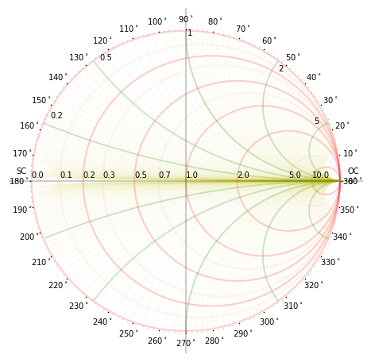
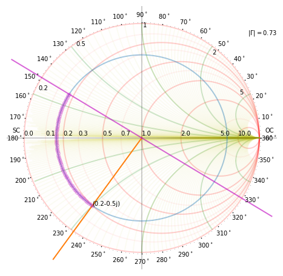
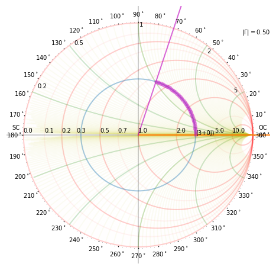
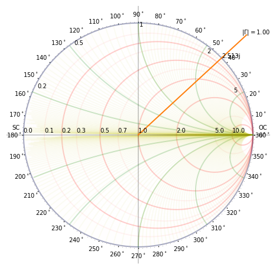
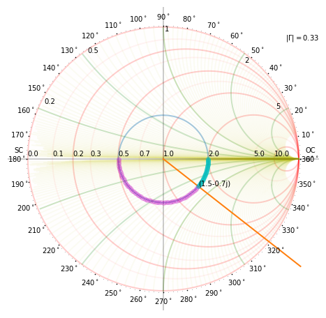

```python
from pylab import *
%pylab inline

rcParams['figure.figsize'] = (10,10/1.618034)

rcParams['xtick.labelsize'] = 14
rcParams['ytick.labelsize'] = 14

rcParams['axes.labelsize'] = 18
rcParams['axes.titlesize'] = 20
rcParams['axes.linewidth'] = 2
rcParams['lines.linewidth'] = 2

rcParams['legend.fontsize'] = 18
rcParams['axes.grid'] =True
rcParams['grid.alpha'] = 0.2

rcParams['lines.markersize'] = 1
```

    Populating the interactive namespace from numpy and matplotlib


    /usr/local/lib/python3.5/dist-packages/IPython/core/magics/pylab.py:160: UserWarning: pylab import has clobbered these variables: ['random', 'info', 'linalg', 'fft', 'power']
    `%matplotlib` prevents importing * from pylab and numpy
      "\n`%matplotlib` prevents importing * from pylab and numpy"


Smith Chart Plotting in Python
==============================

## Smith Chart Maths
The smith chart has constant resistance and reactance circles on the complex $\Gamma$  plane.
Specifically these are restricted to the area $|\Gamma|\le 1.0$ on the complex $\Gamma$ plane.

**I believe that the first step in understanding smith charts is to know how to plot them.**

This is a simple code to plot the smith chart and custom curves can be added as required.

The solution to the examples from "Shevgaonkar" text are also included.
The solution for examples from other texts will be included soon.


## Smith Chart equations

The voltage reflection coefficient is 
$$
\Gamma = \cfrac{Z_{L}-Z_0}{Z_L+Z_0} = \left| \Gamma \right|e^{j\theta_{\Gamma}}
$$
The normalized impedance is 
$$
z_L = \cfrac{Z_{L}}{Z_{0}} = \cfrac{R_{L}}{R_{0}}+j \cfrac{X_{l}}{Z_{0}}=r+jx
$$

Relation between $\Gamma$ and normalized impedance is 
$$
\Gamma =  \Gamma_r + i\Gamma_{i} = \cfrac{z_{L}-1}{z_L+1} \\
  z_L = r + jx = \cfrac{1+\Gamma}{1-\Gamma} \\
       = \cfrac{1-\Gamma_{r}^2-\Gamma_{i}^2}{(1-\Gamma_r)^2+\Gamma_i^2}
         + \cfrac{2\Gamma_i}{(1-\Gamma_r)^2+\Gamma_i^2}
$$

The real part of the normalized impedance can be rearranged as
$$
         r =
             \cfrac{1-\Gamma_{r}^2-\Gamma_{i}^2}{(1-\Gamma_r)^2+\Gamma_i^2}\\
         r ( (1-\Gamma_r)^2+\Gamma_i^2) =
            1-\Gamma_{r}^2-\Gamma_{i}^2\\
  r + r \Gamma_r^2 - 2 r \Gamma_r + r\Gamma_i^2 =
                     1-\Gamma_{r}^2-\Gamma_{i}^2\\
  r \Gamma_r^2 - 2 r \Gamma_r +\Gamma_r^2  + r\Gamma_i^2 + \Gamma_i^2
  = 1-r\\
   (1+r)\Gamma_r^2 - 2 r \Gamma_r  + (1+r)\Gamma_i^2 
           = 1-r\\
   \Gamma_r^2 - \cfrac{2r}{1+r}  \Gamma_r  + \Gamma_i^2 
           = \cfrac{1-r}{1+r} \\
  \Gamma_r^2 - \cfrac{2r}{1+r}  \Gamma_r + \cfrac{r^{2}}{(1+r)^{2}} + \Gamma_i^2 
           = \cfrac{1-r}{1+r} + \cfrac{r^{2}}{(1+r)^{2}} \\
  \left(  \Gamma_r - \cfrac{r}{1+r}  \right)^{2}  + \Gamma_i^2 
           = \cfrac{1}{(1+r)^{2}} 
$$

The imaginary part of the normalized impedance can be rearranged as

$$
  x = \cfrac{2\Gamma_{i}} {(1-\Gamma_r)^2 + \Gamma_i^{2}} \\
  x + x\Gamma_r^2 - 2 x \Gamma_r + x \Gamma_i^2 = 2 \Gamma_i\\
  \Gamma_r^2 - 2 \Gamma_r + 1 +  \Gamma_i^2 - \cfrac{2}{x} \Gamma_i = 0  \\
 ( \Gamma_r-1)^2 + \left( \Gamma_i - \cfrac{1}{x} \right)^2  = \left(
                                                               \cfrac{1}{x}
                                                               \right)^{2} 
$$


These two equations correpond to the resistance and reactance circles on the complex $\Gamma$ plane.
 

\begin{align*}
  \left(  \Gamma_r - \cfrac{r}{1+r}  \right)^{2}  + \Gamma_i^2 
  &= \cfrac{1}{(1+r)^{2}} \\
   ( \Gamma_r-1)^2 + \left( \Gamma_i - \cfrac{1}{x} \right)^2  &= \left(
                                                               \cfrac{1}{x}
                                                               \right)^{2}   
\end{align*}

# Plot the Smith Chart


```python
from pylab import *
```


```python
from smith_chart import plot_smith
```


```python
plot_smith()
show()
```





# Some Examples from "Shevgaonkar"


```python
run Q20.py
```





    <Figure size 720x444.984 with 0 Axes>


```python
run Q21.py
```





```python
run Q22.py
```





```python
run Q25.py
```





```python

```
